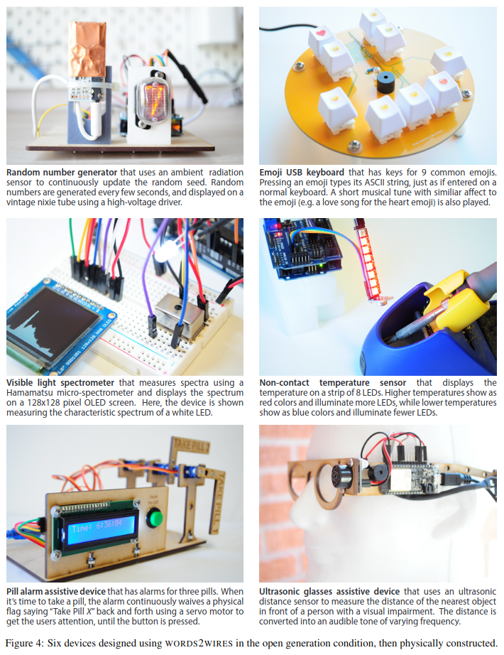

# Words2Wires
This repository is for the paper ["From Words to Wires: Generating Functioning Electronic Devices from Natural Language Descriptions"](https://tinyurl.com/3ahf9dde) (Arxiv 2023)

This paper demonstrates a previously unknown skill of large language models like GPT-4: The ability to design working electronic devices (including schematics and microcontroller code) from high-level text descriptions of those devices (like, "make a device that turns on an LED when a button is pressed").  Here are some devices whose initial drafts were generated by GPT-4, then reviewed and corrected by a human before being physical constructed:



&nbsp;
# Video

The video provides a great high-level introduction to the project, and example builds:

[](https://youtu.be/PZ1rr0dDAPI)

&nbsp;
## Quickstart

### Environment Setup
Clone the repository:
```bash
git clone https://github.com/cognitiveailab/words2wires.git
cd words2wires
```

Install Dependencies:
```bash
conda create --name words2wires python=3.9
conda activate words2wires
pip install -r requirements.txt
```

You will also need to set your OpenAI and/or Anthropic keys as environment variables:
```bash
# Set OpenAI Key (for GPT models)
export OPENAI_API_KEY=<YourKeyHere>

# Set Anthropic key (for Claude model)
export ANTHROPIC_API_KEY=<YourKeyHere>
```
*WARNING: Many of these prompts (and their completions) can be quite long.  You can incur significant cost to your OpenAI/Anthropic accounts by running this code.  As a (non-binding) example, single device generation may cost near $0.50 - $1.00.*


### Pins100 Benchmark (Experiment 1)

You can run the Pins100 benchmark with the following command:
```
python GeneratePinouts.py --engine=gpt-3.5-turbo
```
You can substitute the `engine` parameter with any valid engine (currently: `gpt-3.5-turbo`, `gpt-4`, `claude-v1`).
The output (pinout generations) will be displayed on the console, and saved to a file named `generated.pinouts.<engine>.json`.


### Micro25 Benchmark (Experiment 2)
You can run a single device in the Micro25 benchmark with the following command:
```
python GenerateDevice.py --task=input-digital-button --engine=gpt-4
```
You can substitute the `engine` parameter with any valid engine (currently: `gpt-4`, `claude-v1`).
The output (device specification, as both a JSON and human-readable TXT file) will be saved to the current directory by default.  You can change this location with the `pathOut` command.  By filenames are verbose (e.g. `generated-input-digital-button.gpt-4.gen0.json`).

The tasks are specified in a TSV file.  If you want to run more than one task, you can use the `tasks` command, and provide a comma-delimited list:
```
python GenerateDevice.py --tasks=input-digital-button,output-motor-servo --engine=gpt-4
```

If you want to run *all* the tasks in a TSV file, you can use the `--all` command.  
*WARNING, use this option very carefully, as you may incur significant cost from running a large number of tokens through the APIs.*
```
python GenerateDevice.py --all --engine=gpt-4 --filenameIn=experiment2-25devicebenchmark/micro25-benchmark.tsv
```
By default, `GenerateDevice.py` points to a task file with more than the `Micro25` benchmarks specified.  To run just the `Micro25` benchmark, point it to the `micro25-benchmark.tsv` file.

### Generating your own devices (Experiment 3)
The easiest way to generate a new device is to add it's specification to the `words2wires-task-descriptions.tsv` file, located in the Experiment 3 folder.  Generation requires giving each device a name (e.g. `mydevice1`), a target platform (e.g. `Arduino Uno`), and a task description (e.g. `Generate a device that blinks an LED when a button is pressed`). 

Once the line has been added to the TSV file, you can run the device generation using the following example command, similar to Experiment 2:
```
python GenerateDevice.py --task=mydevice1 --engine=gpt-4
```

By default, the code requests greedy decoding (e.g. `temperature=0`), but you can change this with the `--temperature` argument (e.g. `--temperature=0.1`).  You can also generate more than one generation at a time using the `--numGenerations` argument (e.g. `--numGenerations=3`). 

Output files are overwritten by subsequent calls -- be sure to move your files to a new location and save them (or, use the `--pathOut` argument) if you'd like to keep them.

&nbsp;
## Benchmarks

The Pins100 benchmark can be found here: [experiment1-pinouts/pins100-benchmark.tsv](https://github.com/cognitiveailab/words2wires/blob/main/experiment1-pinouts/pins100-benchmark.tsv)

The Micro25 benchmark can be found here: [experiment2-25devicebenchmark/micro25-benchmark.tsv](https://github.com/cognitiveailab/words2wires/blob/main/experiment2-25devicebenchmark/micro25-benchmark.tsv)

&nbsp;
## Results

### Pins100
Model-generated data can be found in the [experiment1-pinouts](https://github.com/cognitiveailab/words2wires/tree/main/experiment1-pinouts) folder in `JSON` format.  Errors are manually annotated in the `evalNotes` for each component.  Average scores are calcualted using the Excel file.

### Micro25
Raw model-generated output from both `gpt-4` and `claude-v1` can be found in the [experiment2-25devicebenchmark](https://github.com/cognitiveailab/words2wires/tree/main/experiment2-25devicebenchmark) folder.  A subset of examples have screenshots from the `TinkerCad` simulator.  Average scores and evaluation notes are provided in the Excel file.

### Open-generation condition
Example output files are provided in the [experiment3-opengeneration/generated](https://github.com/cognitiveailab/words2wires/tree/main/experiment3-opengeneration/generated) folder, including a few more devices than are discussed in the paper.  Pictures of builds are provided in the paper and Youtube video. 

&nbsp;

# Frequently Asked Questions
**Q: Can I use `words2wires` as a library?**

A: Yes, simply by including the `Words2Wires.py` file in your repository, adding the necessary requirements to your `requirements.txt` file.  See `GenerateDevice.py` for an example.  The library will likely be `pip`-installable shortly -- star this repository and check back soon for updates~

**Q: Where is the prompt for generating devices?**

A: The prompt for device generation is here: https://github.com/cognitiveailab/words2wires/blob/417cd96033cf780e21892a0a3ae015aa2117ffcc/Words2Wires.py#L434

This includes the "DeveloperGPT" prompt preamble by [@skirano](https://twitter.com/skirano) : https://twitter.com/skirano/status/1635736107949195278

**Q: Where are the full text descriptions for the devices in Experiment 2 (micro25) and Experiment 3 (open generation)?**

A: These are in the TSV task description file: https://github.com/cognitiveailab/words2wires/blob/main/experiment3-opengeneration/words2wires-task-descriptions.tsv


**Q: How do I try this out with my own device ideas?**

A: Please see the `quickstart` above, and in particular Experiment 3 (open generation).  Essentially, once you have the environment setup, you just need to add your device descriptions to the tab-delimited text file.  See the TSV file for examples.

**Q: There are more open generation devices in the TSV file than are described in the paper**

A: Yes, more open generation devices were explored -- and likely many more soon!  Space in the paper is unfortunately limited.


&nbsp;
# Contact

Comments, questions, bug reports, and cool use-cases are welcome.  For bug reports or issues, please use the Github issue tab. 
The primary benefit of academic open source work, other than attribution, is seeing others use your work.  If you use this, please send a short note, or tag me on Twitter! (`@peterjansen_ai`)

`Dr. Peter Jansen <pajansen@arizona.edu>`.

Web: https://cognitiveai.org/

Twitter: https://twitter.com/peterjansen_ai

&nbsp;
# Citation

Please cite the following:

```
@misc{words2wires,
    title={From Words to Wires: Generating Functioning Electronic Devices from Natural Language Descriptions 	},
    author={Peter Jansen},
    year={2023},
    archivePrefix={arXiv},
    primaryClass={cs.CL},
}
```
